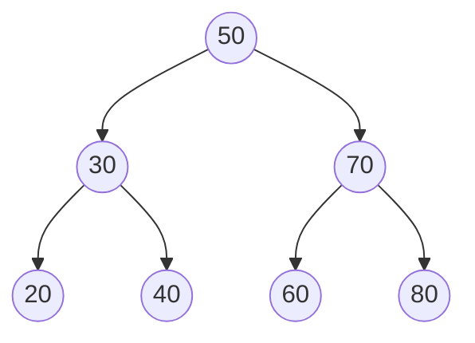

# Binary Search Tree

A Binary Search Tree (BST) is a binary tree where each node has a key/value associated with it, and the keys in the left subtree are less than the key in the root, while the keys in the right subtree are greater than the key in the root. This property ensures that the elements in the BST are stored in a sorted order.

## Basic operations
The basic operations that can be performed on a BST are:

1. **Insertion**: A new node with a given key is inserted into the BST in a way that maintains the BST property.
1. **Deletion**: A node with a given key is deleted from the BST in a way that maintains the BST property.
1. **Search**: A search operation can be performed on the BST to find a node with a given key. If the node is found, its value can be returned. Otherwise, an error can be raised.
1. **Traversal**: The nodes in a BST can be traversed in a variety of orders: Inorder, Preorder, and Postorder. Inorder traversal prints the nodes in ascending order of their keys. Preorder traversal prints the root node first, followed by the left and right subtrees. Postorder traversal prints the left and right subtrees first, followed by the root node.
1. **Minimum and Maximum**: The minimum node (with the smallest key) and maximum node (with the largest key) can be found in the BST by traversing to the leftmost and rightmost nodes, respectively.
1. **Successor and Predecessor**: The successor of a node is the node with the smallest key greater than the node's key, and the predecessor of a node is the node with the largest key smaller than the node's key. These can be found using a combination of traversal and search operations.

## Complex operations


1. **Balancing**: Binary Search Trees can become unbalanced over time due to repeated insertion and deletion operations. Balancing algorithms can be used to rebalance the tree to ensure efficient search, insertion, and deletion operations.
1. **Lowest Common Ancestor (LCA)**: The LCA of two nodes in a Binary Search Tree is the node that is the lowest ancestor of both nodes. This can be computed using recursive or iterative algorithms.
1. **Check if a Binary Tree is a Binary Search Tree**: A Binary Tree can be checked if it is a Binary Search Tree or not by performing an in-order traversal of the tree and checking if the elements are in sorted order.
1. **Kth Smallest and Largest Element**: The Kth smallest and largest element in a Binary Search Tree can be found by performing an in-order traversal and keeping track of the number of nodes visited so far.
1. **Inorder Successor and Predecessor**: The Inorder Successor of a node is the node with the smallest key greater than the node's key, and the Inorder Predecessor of a node is the node with the largest key smaller than the node's key. These can be found using a combination of traversal and search operations.
1. **Delete Node with Two Children**: Deleting a node with two children in a Binary Search Tree requires careful handling of the children nodes to maintain the BST property.
1. **Floor and Ceiling**: The Floor of a key in a Binary Search Tree is the node with the largest key smaller than or equal to the given key, and the Ceiling of a key is the node with the smallest key greater than or equal to the given key. These can be found using search and traversal operations.
1. **Check if a Binary Tree is a Subtree of Another Binary Tree**: A Binary Tree can be checked if it is a subtree of another Binary Tree by comparing the in-order traversals of the trees.
1. **Morris Inorder Traversal**: Morris Inorder Traversal is a space-optimized algorithm to perform in-order traversal of a Binary Search Tree in constant space without using a stack or recursion.
1. **Check if Two Binary Trees are Identical**: Two Binary Trees can be checked if they are identical or not by recursively comparing the corresponding nodes in the trees.

## Examples 



## Uses


1. **Dictionaries**: Binary search trees can be used to implement dictionaries, where keys are stored in a sorted order for efficient searching, insertion, and deletion.
1. **Symbol Tables**: Symbol tables in compilers, interpreters, and other software applications can be implemented using binary search trees to efficiently store and retrieve information.
1. **File Systems**: Binary search trees can be used to implement file systems, where directories and files are stored in a sorted order for efficient search operations.
1. **Priority Queues**: Binary search trees can be used to implement priority queues, where the keys represent the priorities and are stored in a sorted order.
1. **Routing Tables**: Binary search trees can be used to implement routing tables in computer networks, where the IP addresses are stored in a sorted order for efficient routing.
1. **Auto-Completion**: Binary search trees can be used to implement auto-completion functionality in software applications, where a sorted list of suggestions is provided to the user as they type.
1. **Spell Checking**: Binary search trees can be used to implement spell checking functionality in software applications, where a dictionary of words is stored in a sorted order for efficient searching and suggestions.
1. **Range Queries**: Binary search trees can be used to efficiently perform range queries, where all keys within a given range are returned.
1. **Huffman Coding**: Binary search trees can be used to implement Huffman coding, which is a lossless data compression algorithm.
1. **AVL Trees and Red-Black Trees**: AVL trees and Red-Black trees are types of self-balancing binary search trees that are commonly used in database systems and other software applications to provide efficient search, insertion, and deletion operations.


## API

```go
type Node struct {
    Val   int
    Left  *Node
    Right *Node
}

type BST struct {
    Root *Node
}

func (t *BST) Search(val int) *Node {
    // search for a node with the given value in the tree
}

func (t *BST) Insert(val int) {
    // insert a new node with the given value into the tree
}

func (t *BST) Delete(val int) {
    // delete a node with the given value from the tree
}

func (t *BST) TraverseInorder() []int {
    // return a slice of values obtained by traversing the tree in inorder
}

func (t *BST) TraversePreorder() []int {
    // return a slice of values obtained by traversing the tree in preorder
}

func (t *BST) TraversePostorder() []int {
    // return a slice of values obtained by traversing the tree in postorder
}

func (t *BST) Min() int {
    // return the minimum value in the tree
}

func (t *BST) Max() int {
    // return the maximum value in the tree
}

```


## Easy problems


1. Implement a Binary Search Tree class with basic operations like insertion, deletion, search, and traversal.
1. Find the minimum and maximum elements in a Binary Search Tree.
1. Find the height of a Binary Search Tree.
1. Check if a given element exists in a Binary Search Tree.
1. Implement an in-order traversal of a Binary Search Tree.
1. Implement a pre-order traversal of a Binary Search Tree.
1. Implement a post-order traversal of a Binary Search Tree.
1. Find the level order traversal of a Binary Search Tree.
1. Find the number of nodes in a Binary Search Tree.
1. Find the number of leaves in a Binary Search Tree.
1. Check if a Binary Search Tree is balanced or not.
1. Find the diameter of a Binary Search Tree.
1. Convert a Binary Search Tree to an array.
1. Convert a sorted array to a Binary Search Tree.
1. Find the lowest common ancestor of two nodes in a Binary Search Tree.
1. Find the kth smallest element in a Binary Search Tree.
1. Find the kth largest element in a Binary Search Tree.
1. Find the successor of a node in a Binary Search Tree.
1. Find the predecessor of a node in a Binary Search Tree.
1. Find the sum of all elements in a Binary Search Tree.
1. Find the sum of all elements greater than a given element in a Binary Search Tree.
1. Check if a Binary Search Tree is a subtree of another Binary Search Tree.
1. Check if two Binary Search Trees are equal.
1. Check if a Binary Search Tree is a mirror image of another Binary Search Tree.
1. Delete the minimum element from a Binary Search Tree.
1. Delete the maximum element from a Binary Search Tree.
1. Delete a given element from a Binary Search Tree.
1. Find the height of the left and right subtrees of a given node in a Binary Search Tree.
1. Find the minimum and maximum elements in the left and right subtrees of a given node in a Binary Search Tree.
1. Find the inorder traversal of a Binary Search Tree without using recursion.

## Intermediate Problems


1. Find the kth smallest element in a Binary Search Tree in O(h) time complexity, where h is the height of the tree.
1. Find the lowest common ancestor of two nodes in a Binary Search Tree in O(h) time complexity, where h is the height of the tree.
1. Check if a given Binary Search Tree is a valid Binary Search Tree.
1. Check if a given Binary Search Tree is a balanced Binary Search Tree.
1. Find the mode(s) of a Binary Search Tree, i.e., the element(s) that occur(s) the most number of times.
1. Convert a Binary Search Tree to a balanced Binary Search Tree.
1. Find the sum of all elements in a Binary Search Tree in O(n) time complexity, where n is the number of nodes in the tree.
1. Find the sum of all elements greater than or equal to a given element in a Binary Search Tree.
1. Find the second largest element in a Binary Search Tree.
1. Find the inorder successor of a given node in a Binary Search Tree.
1. Find the inorder predecessor of a given node in a Binary Search Tree.
1. Check if a given Binary Search Tree is a subtree of another Binary Search Tree.
1. Find the maximum width of a Binary Search Tree.
1. Convert a Binary Search Tree to a doubly linked list.
1. Convert a Binary Search Tree to a circular doubly linked list.
1. Find the maximum difference between any two nodes in a Binary Search Tree.
1. Find the height of a Binary Search Tree without recursion.
1. Find the closest value to a given element in a Binary Search Tree.
1. Serialize and deserialize a Binary Search Tree.
1. Find the sum of all elements between two given elements in a Binary Search Tree.
1. Find the difference between the sums of all nodes at even and odd levels in a Binary Search Tree.
1. Find the LCA (Least Common Ancestor) of two nodes in a Binary Search Tree in O(1) space complexity.
1. Convert a Binary Search Tree to a greater sum tree, where each node contains the sum of all nodes greater than itself.
1. Find the kth largest element in a Binary Search Tree without recursion.
1. Find the maximum sum path between any two nodes in a Binary Search Tree.
1. Find the kth smallest element in a Binary Search Tree without recursion.
1. Find the vertical sum of a Binary Search Tree.
1. Find the maximum product of any two nodes in a Binary Search Tree.
1. Find the minimum difference between any two nodes in a Binary Search Tree.
1. Check if a given Binary Search Tree is a mirror image of another Binary Search Tree.


